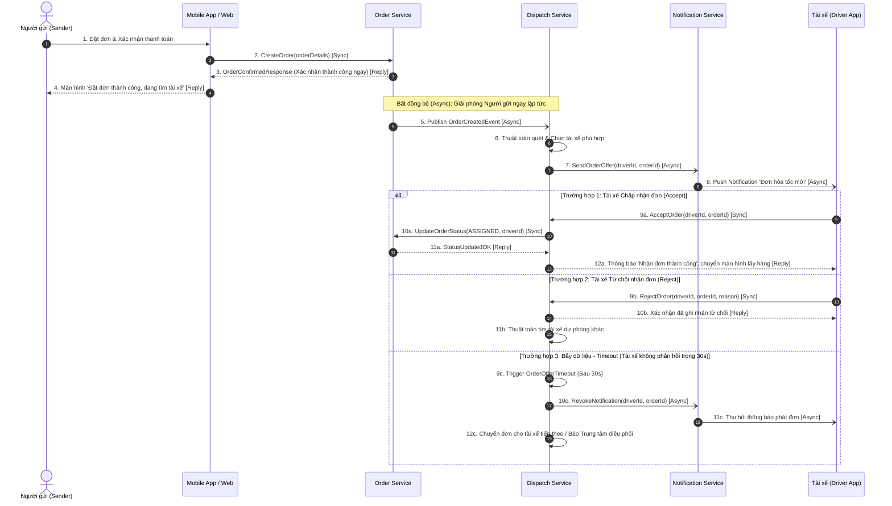

# THIẾT KẾ KIẾN TRÚC VÀ LUỒNG TƯƠNG TÁC (SEQUENCE DIAGRAM) PHÁT ĐƠN HỎA TỐC RIKKEI LOGISTICS EXPRESS

> 👤 **Học viên:** Đỗ Hoàng Sơn | **Mã SV:** PTIT-HCM-066
> 🏫 **Môn học:** IT105-K25-Phan-tich-thi-t-k-h-th-ng

---

## 📊 Sơ đồ thiết kế hệ thống (Sequence Diagram)

> 💡 *Sơ đồ dưới đây được render tự động trực tiếp trên GitHub bằng Mermaid. Bạn cũng có thể tải file **`bt1.drawio`** trong repository này để mở và chỉnh sửa trực tiếp trên [Draw.io (diagrams.net)](https://app.diagrams.net).* 

---

## Phần 1: Liệt kê các đối tượng tham gia trong luồng

Để đáp ứng bài toán phát đơn giao hỏa tốc thời gian thực mà không gây ảnh hưởng đến trải nghiệm của Người gửi (Sender), hệ thống được chia thành các đối tượng chính sau đây:

Mỗi đối tượng giữ một vai trò riêng biệt, tuân thủ nguyên tắc đơn nhiệm (Single Responsibility Principle) trong kiến trúc Microservices:

- Sender (Người gửi): Tác nhân người dùng ngoài hệ thống, thực hiện thao tác tạo đơn và xác nhận thanh toán hỏa tốc trên ứng dụng.
- Mobile App / Web (Giao diện Client): Ứng dụng phía người dùng, tiếp nhận thao tác gửi request và hiển thị phản hồi tức thì.
- Order Service (Dịch vụ Đơn hàng): Xử lý nghiệp vụ khởi tạo đơn, lưu trữ trạng thái đơn hàng và xác thực giao dịch thành công.
- Dispatch Service (Dịch vụ Điều phối Đơn): Đối tượng trung tâm chứa thuật toán định vị GPS, ghép nối tài xế phù hợp, quản lý trạng thái phát đơn và xử lý thời gian chờ (timeout).
- Notification Service (Dịch vụ Thông báo Push): Quản lý việc gửi thông báo đẩy (Push Notification/WebSocket) tới thiết bị di động của tài xế.
- Driver (Tài xế / Driver App): Tác nhân tài xế nhận thông báo đơn hỏa tốc và đưa ra thao tác Chấp nhận hoặc Từ chối trên ứng dụng di động.

## Phần 2: Phân tích quy trình nghiệp vụ và Bẫy dữ liệu (Edge Cases)

1. Giải pháp bảo vệ trải nghiệm Người gửi (Sender UX): Để Người gửi không bị rào cản thời gian phản hồi (blocking IO) từ phía tài xế, ngay khi Order Service nhận lệnh tạo đơn và xác nhận thanh toán, hệ thống sẽ trả về kết quả 'Đặt đơn thành công' cho Người gửi trong chưa đầy 200ms. Luồng tìm tài xế sau đó được đẩy xuống Dispatch Service theo mô hình Bất đồng bộ (Asynchronous Event - Message Queue/Event Bus). Người gửi có thể theo dõi trạng thái 'Đang tìm tài xế' trên ứng dụng mà không bị treo màn hình.

2. Xử lý tình huống Tài xế từ chối nhận đơn: Khi tài xế ấn nút 'Từ chối', Dispatch Service lập tức tiếp nhận thông điệp, cập nhật lịch sử tài xế này đã từ chối đơn để tránh phát lại, đồng thời kích hoạt ngay thuật toán quét các tài xế có khoảng cách gần tiếp theo.

3. Xử lý Bẫy dữ liệu (Edge Case - Timeout tài xế không thao tác): Nếu tài xế nhận thông báo nhưng cố tình hoặc vô ý không bấm chọn trong khoảng thời gian quy định (ví dụ: 30 giây), hệ thống sẽ kích hoạt một Timer Timeout. Khi hết 30 giây, Dispatch Service phát lệnh thu hồi thông báo trên App tài xế đó, đồng thời chuyển tiếp đơn hàng sang tài xế mới hoặc đẩy về Trung tâm điều phối nếu đã hết tài xế khả dụng.

- Mô hình Bất đồng bộ (Async Event Driving) đảm bảo decoupled giữa khâu tạo đơn và khâu gán tài xế.
- Sử dụng khối alt/else trong Sequence Diagram thể hiện rõ 3 luồng rẽ nhánh: Đồng ý, Từ chối và Timeout.
- Cơ chế thu hồi lệnh phát đơn (Notification Revocation) đảm bảo tránh trường hợp 2 tài xế cùng nhận chung một đơn hỏa tốc.

## Phần 3: Đặc tả chi tiết thông điệp trong Sequence Diagram

Bảng tổng hợp chi tiết toàn bộ các bước thông điệp (Messages) xuất hiện trong sơ đồ Sequence Diagram:

| STT | Đối tượng gửi | Đối tượng nhận | Tên thông điệp / Thao tác | Loại thông điệp | Mô tả chi tiết nghiệp vụ |
| --- | --- | --- | --- | --- | --- |
| 1 | Sender | Mobile App | Xác nhận đặt đơn hỏa tốc | Synchronous | Người gửi chọn dịch vụ hỏa tốc và bấm Xác nhận thanh toán |
| 2 | Mobile App | Order Service | CreateOrder(orderDetails) | Synchronous | Gửi yêu cầu tạo đơn hàng lên hệ thống Backend |
| 3 | Order Service | Mobile App | OrderConfirmedResponse | Reply Message | Trả về thông báo đơn đã ghi nhận thành công thành công |
| 4 | Mobile App | Sender | Hiển thị màn hình thành công | Reply Message | Người gửi thấy trạng thái 'Thành công - Đang tìm tài xế' |
| 5 | Order Service | Dispatch Service | OrderCreatedEvent | Asynchronous | Bắn sự kiện sang hệ thống điều phối thông qua Event Bus |
| 6 | Dispatch Service | Dispatch Service | FindNearestDriver() | Self-Call | Chạy thuật toán tính khoảng cách GPS tìm tài xế tối ưu |
| 7 | Dispatch Service | Notification Service | SendOrderOffer(driverId, orderId) | Asynchronous | Gửi yêu cầu đẩy thông báo phát đơn |
| 8 | Notification Service | Driver | Push Notification 'Đơn mới' | Asynchronous | Hiển thị popup nhận đơn kèm đếm ngược 30s trên Driver App |
| 9a | Driver | Dispatch Service | AcceptOrder(driverId, orderId) | Synchronous | Tài xế bấm nút 'Nhận đơn' thành công |
| 10a | Dispatch Service | Order Service | UpdateOrderStatus(ASSIGNED) | Synchronous | Cập nhật đơn hàng sang trạng thái 'Đã gán tài xế' |
| 9b | Driver | Dispatch Service | RejectOrder(driverId, orderId) | Synchronous | Tài xế bấm nút 'Từ chối nhận đơn' |
| 11b | Dispatch Service | Dispatch Service | ReRouteDriver() | Self-Call | Kích hoạt tìm kiếm tài xế tiếp theo trong danh sách |
| 9c | Dispatch Service | Dispatch Service | OrderOfferTimeout (30s) | Self-Call / Edge Case | Hết 30 giây đếm ngược tài xế không phản hồi |
| 10c | Dispatch Service | Notification Service | RevokeNotification() | Asynchronous | Yêu cầu ẩn/thu hồi thông báo phát đơn trên thiết bị |

## Phần 4: Đánh giá và Hướng dẫn file Draw.io

Thiết kế trên giải quyết triệt để yêu cầu bài toán đề ra: đảm bảo trải nghiệm tức thì cho Người gửi bằng kiến trúc Event-Driven bất đồng bộ, đồng thời bao phủ đầy đủ các kịch bản thực tế của tài xế (Nhận đơn, Từ chối đơn, Timeout bỏ qua đơn).

Toàn bộ sơ đồ đã được cấu trúc tương thích với công cụ Draw.io (diagrams.net). Sinh viên có thể nhập mã Mermaid hoặc mở file .drawio đi kèm trong repository để xem bản vẽ minh họa chi tiết với đầy đủ các khối alt/else, nét đứt phản hồi và mũi tên bất đồng bộ.

---

## 📁 Danh sách tệp tin nộp bài trong Repository
- 📝 `bt1.docx`: Báo cáo tài liệu phân tích nghiệp vụ hoàn chỉnh.
- 🎨 `bt1.drawio`: File thiết kế sơ đồ chuẩn theo quy định đề bài (mở trực tiếp bằng [Draw.io](https://app.diagrams.net) hoặc Lucidchart).
